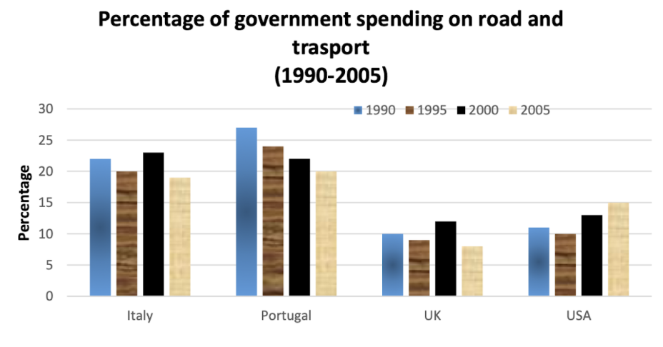

## <h1 style="text-align: center;">WRITING</h1>

# <h1 style="text-align: center;">NOUN-PHRASES</h1>
## Clause
``S + V + (O)``
- Verb:
    - Intransitive $\rightarrow$ ``SV`` (E.g. Work).
    - Transitive $\rightarrow$ ``SVO`` (E.g. Do).
## N-phrases
- **Pre-modifier**:
    - ``ADJ + N`` $\rightarrow$ Characteristic.
    - ``N + N`` $\rightarrow$ Featuring/Platform.
- **Post-modifier**:
    - ``N + Ving/V3ed`` $\rightarrow$ Reduced form of relative clause.

# <h1 style="text-align: center;">PARAPHRASING</h1>
## Synonyms
- Condition:
    1. Part of speech
    2. Meaning
!!! example
    - State-of-the-art / Cutting-edge + ``N ➡️ Máy móc, công nghệ, thiết bị, dụng cụ, phát minh, ứng dụng, thiết kế tiên tiến, tối tân.``
    - Contemporary + ``N ➡️ Suy nghĩa, điệu múa, âm nhạc, văn hoá, xã hội, lối sống, nền văn minh, con người.``
## Part of speech / Word form
- **Step 1**. Define word having family words.
- **Step 2**. Translate to Viet sentence obtained family words.
- **Step 3**. Translate to Eng.
### Practice
| TOPIC | SENTENCE STRUCTURE |
| ----------- | ----------- |
| **POPULARITY 📈** | - An increasing number of ``noun`` have a tendency to ``verb``. <br/> - During the past few years, ``noun`` has become increasingly popular. <br/> - Over the last decades, ``noun`` has gained increasing popularity. |
| **2 VIEWS 👀** | - A school of thought holds that ``     ``. <br/> - Some opine that ``     ``. <br/> - Some are of the opinion that ``     ``. <br/> - Some hold a firm belief that ``     ``. |

!!! Note
    Modal verb (should, could,...) ➡️ passive voice

# <h1 style="text-align: center;">TASK 1</h1>

- **Chart type**:
    - bar / column
    - line
    - pie
    - table
- **Group type**:
    - time period 
    - discrete categories 

## INTRODUCTION

### Goal
- **Paraphrase** the task.
    - Synonyms.
    - Part of speech $\rightarrow$ word form.
- Changing the sentence **structures**.

### Paraphrase skills
| ORIGINAL | CHANGING TO | NOTE |
| ----------- | ----------- | ----------- |
| graph / diagram | - the given ``   `` <br/> - the provided ``   `` | ``   ``: line graph, bar chart, column chart, pie chart |
| below | | omitted |
| show | - illustrate <br/> - depict <br/> - compare <br/> - contrast | don't miss **s** if several. |
| information about | data on ``   `` in ``the subject under survey`` | (not important) <br/> - time period $\rightarrow$ ``   ``: the changes <br/> - without time period $\rightarrow$ ``   ``: the differences  |
| from year ``  `` to year ``  `` | - between ``  `` and ``  `` <br/> - over the course of ``  `` years from ``  `` to ``  `` <br/> - during the period spanning from ``  `` to ``  `` | in ``  `` $\rightarrow$ in the year ``  `` |

### Paraphrase skills for ``the subject under survey``
| ORIGINAL | CHANGING TO | EXAMPLE |
| ----------- | ----------- | ----------- |
| *data/figures* | - the number of ``noun (countable) + Ving/3ed`` <br/> - the amount of ``noun (uncountable) + Ving/3ed`` <br/> - the proportion (percentage/rate) of ``noun + Ving/3ed``| - the amount of money invested <br/> - the amount of money earned <br/> - the proportion of people using the local library <br/> - the amount of gas emitted from 2 different private vehicles. |
| ``subject A`` in ``country B`` | ``demonym B`` + ``subject A`` | Children in Australia $\rightarrow$ Australian children |

!!! Info
    For another words $\rightarrow$ [synonyms](synonymslist.md).

### Samples
| ORIGINAL | CHANGED |
| ----------- | ----------- |
| The table below shows information about the monthly investment of American government in education in 2010. | The provided table illustrates (data on the differences in) the amount of money allocated for education on a monthly basis by the government in America in the year 2010. |
| he line graph below shows the percentage of travelers who visited four different attractions in Brighton in 2009. | The given line graph depicts the proportion of many of tourists visiting four different spots over the course of years from 2000 to 2010. |
| The bar chart gives information about the yearly spending on healthcare service by the government in America from 1970 to 1980. | The provided bar chart shows data on the amount of money spent per year on medical-care service by the government in the US during the period spanning from 1970 to 1980. |

## OVERVIEW

!!! abstract
    === "**Time period**"
       ```markdown
        - Changes (starting - ending point).
        - Comparison among the categories.
       ```
    === "**Discrete categories**"
       ```markdown
       - Comparison among the categories.
       ```


!!! Tip
    === "**Overview > 2 sentences**"
        ```markdown
        - Introduction 1 paragraph.
        - Overview 1 paragraph.
        ```
    === "**Overview = 1 sentence**"
        ```markdown
        - Introduction & overview 1 paragraph.
        ```

### Opening
- Overall, (it can be seen clearly from the chart) ``    ``
- Another highlight is that ``    ``

### Describe key trends
| TENDENCY | VERB | NOUN | NOTE |
| ----------- | ----------- | ----------- | ----------- |
| **INCREASE** | - increase <br/> - rise <br/> - grow <br/> - go up | - increase <br/> - rise <br/> - growth | rise $\rightarrow$ V2 $\rightarrow$ rose |
| **DECREASE** | - decrease <br/> - decline <br/> - drop <br/> - fall <br/> - go down | - decrease <br/> - decline <br/> - drop <br/> - fall | - drop $\rightarrow$ V2 $\rightarrow$ dropped <br/> - fall $\rightarrow$ V2 $\rightarrow$ fell |
| **NO CHANGE** | - remain unchaged (stable/ constant) | | remain + ``almost 💯  (relatively 👀)`` |
!!! warning
    **USING ALL V2** FOR KEY TRENDS !!!

### Adverb
| STRONG | WEAK |
| ----------- | ----------- |
| - significantly <br/> - considerably <br/> - sharply <br/> - substantially <br/> - exponentially <br/> - noticeably <br/> - remarkably | - slightly <br/> - moderately <br/> - marginally |

!!! Note
    - **Intransitive verb** $\rightarrow$ **adv** + v | v + **adv**.
    - **Transitive verb** $\rightarrow$ **adv** + VO | VO + **adv**.

### Structures
| STRUCTURE | EXAMPLE | Note |
| ----------- | ----------- | ----------- |
| ``Subject`` ``Verb`` ``Adv`` | The number of cars produced by company A **increase sharply** during the surveyed period. | |
| There was a ``adj`` ``noun (key trend)`` in ``subject`` | In UK, there was a **marginal rise** in the investment in public services. | ``Adj`` is **Adv** bonus above ☝️ changed to Adj form. |
| - ``categories`` witnessed (saw/ experenced) a ``adj`` ``noun (key trend)`` (in ``subject``) <br/> - ``Subject`` witnessed (saw/ experienced) a ``adj`` ``noun (key trend)`` | Beef consumption in England rose sharply, while **France experienced a marginal fall throughout the surveyed period**. | - Maybe use when you see loop word status. <br/> - while / whereas |
| ``Categories`` recorded (displayed) the highest/lowest ``subject`` | - US recorded the highest proportion of spending on education. <br/> - Education in US recorded the highest proportion of spending. | |
| ``Subject 1`` be (``strong/weak``) higher/lower than that in/on/at ``subject 2`` | - The proportion of students attending online classes at center A was much higher than that at center B. <br/> - UK men spent more time exercising than **those** in the US. <br/> - UK and US recorded a far higher proportion of spending on education than **the other countries**.| - **strong**: significantly, considerably, far, much. <br/> - **weak**: slightly, a bit, a little. <br/> - that $\rightarrow$ several $\rightarrow$ **those** <br/> - ``subject 1`` is the best $\rightarrow$ than the other countries (the remaining countries). |

## BODY

### Units
- ``,`` $\rightarrow$ separation. e.g. 100,000,000 <br/>
- ``.`` $\rightarrow$ decimal. e.g. 1.5

!!! example
    5 thousand dollar**s**, 300 million car**s**, 15.7%.

### Preposition
| Preposition | Location | Note | Example |
| ----------- | ----------- | ----------- | ----------- |
| **from ``year x`` to ``year y``** | - ``Subject`` ``Verb`` ``Adv`` + **``from x to y``** <br/> - There was a ``adj`` ``noun (key trend)`` + **``from x to y``** <br/> - ``categories`` witnessed (saw/ experenced) a ``adj`` ``noun (key trend)`` in ``subject`` + **``from x to y``**| Adding specific year <br/> - from ``x`` in year ``X`` to ``y`` in year ``Y`` <br/> - from ``x`` to ``y`` between year ``X`` and year ``Y`` | - The number of cars sold in the UK increased sharply **from 10 million to 20 million cars between 1980 and 1985**. |
| **TIME** <br/> - during <br/> - over <br/> - in <br/> - throughout | **``TIME``** + the ``   `` ``x`` years | -first <br/> - next <br/> - following <br/> - last <br/> **bonus**: 10 years $\rightarrow$ a decade, 20 years $\rightarrow$ 2 decades | - UK witnessed a sighnificant increase in car sales from 5 million to 10 million cars in the first 5 years. |
| **at ``value point``** | - start (begin/ stand)/ finish (end)/ peak + **at ``value point``** <br/> - remain**ed** unchaged (stable/ constant) + **at ``value point``** | - don't miss **V3/ed** <br/> begin $\rightarrow$ began <br/> - peak at = hit (reach) a peak of | - In 1980, car sales in UK **started at 10 million cars**. |
| **to ``figure``** | ``Verb`` ``Adv`` + **to (only/merely) ``figure``** | | - Over the next 10 years, car sales decreased significantly **to only 5 million cars** in 1995. |
| **from ``figure x`` to ``figure y``** | ``noun/verb`` + ``from x to y`` | | - Over the next 20 years, there was a significant drop **from 30 million cars to merely 10 million cars** in 1990. <br/> - Over the next 20 years, car sales declined sharply **from 20 million cars to merely 5 million cars** in 1995. |
| **by / of ``figure x`` to ``figure y``** | - ``verb`` + **by** <br/> - ``noun`` + **of** | - Apply for interval value. <br/> - **by/of** + approximately (roughly) ``x`` to (only/merely) ``y`` | - Over the next 10 yeas, car sales declined sharply **by roughly 15 million cars to merely 5 million cars** in 1995. <br/> - Over the next 10 years, there was a significant drop **of roughly 15 million cars to merely 5 million cars** in 1995. |

### Structure reducing tips
| Original | Changing to | Note | Example |
| ----------- | ----------- | ----------- | ----------- |
| ``Subject`` ``Verb_1`` **and** ``Verb_2`` | ``Subject`` ``Verb_1``**,** ``Verb_2``**-ing** | V1 and V2 is the same subject | - In 1980, car sales in UK started at 10M cars, and then **this figure rose sharply and peaked** at 20M cars in 1985. <br/> -> In 1980, car sales in UK started at 10M cars, and then **this figure rose sharply, peaking** at 20M cars in 1985. |