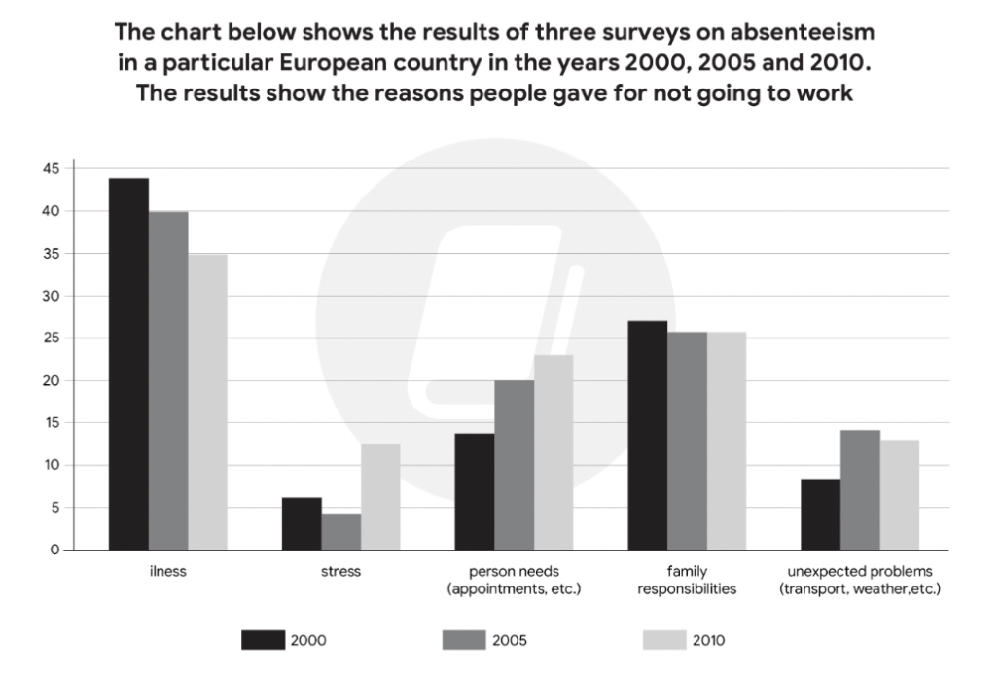
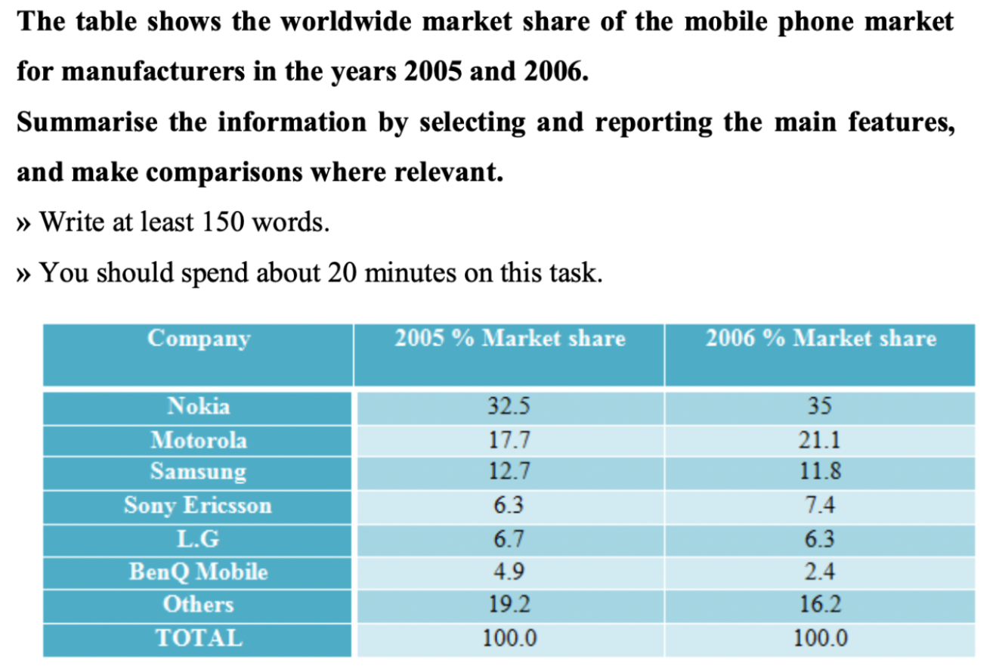
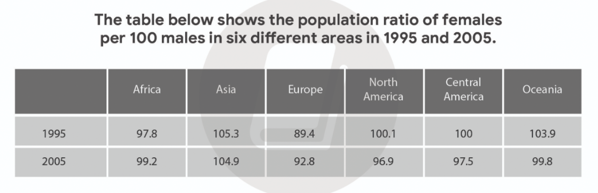

# Introduction

The given bar chart illustrates how many male and female british across 6 different groups in the home duties were divided.

The provided line graph illustrates how many international tourist were visited across 3 different destinations in European state over the course of 20 years from 1987 to 2007.

The given column chart depicts the proportion of European people absented from the workplace based on 5 different causes during the 3 distinct periods 2000, 2005 and 2010.

The given table illustrates the proportion of youth dealt with 7 different issues based on 2 basic education school across 2 separate years 2005 and 2015.

The provided table compares leading mobile phone companies in terms of their global market share between 2005 and 2006.

The given table illustrates the proportion of females to 100 males across 6 distinct destinations between 1995 and 2005.